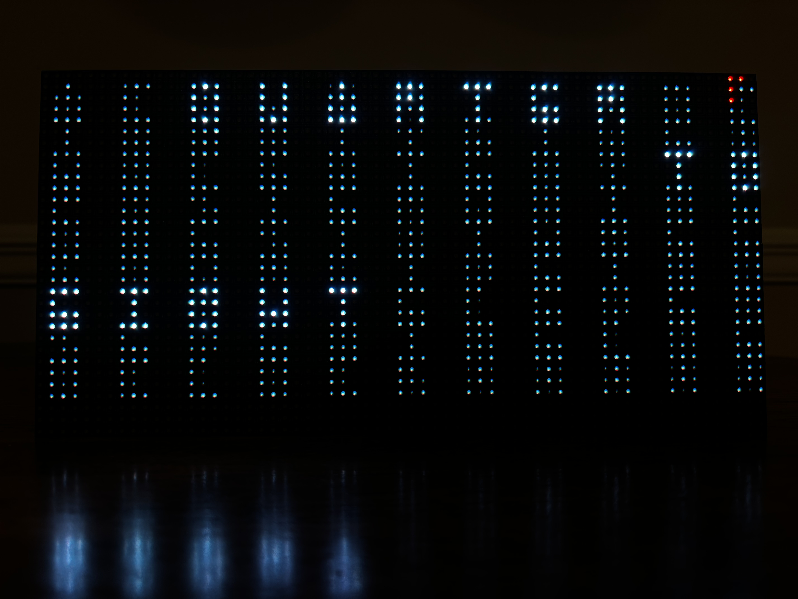
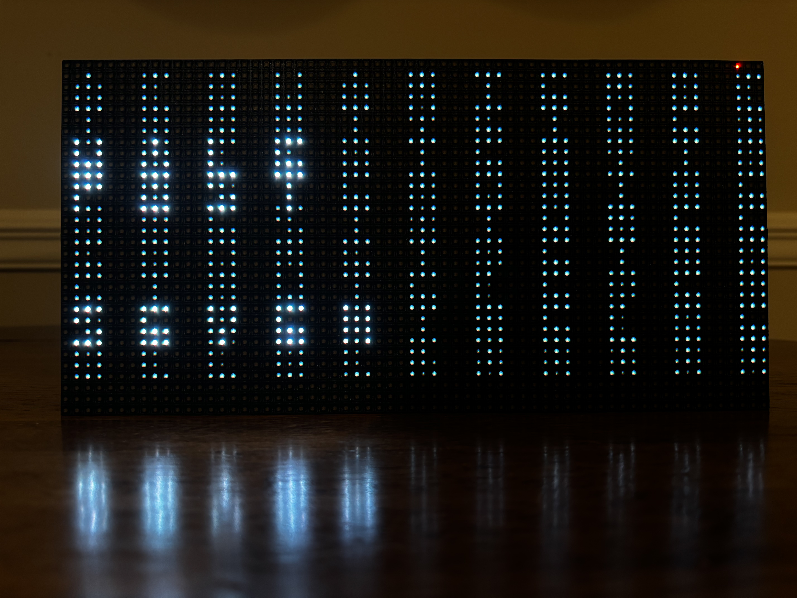
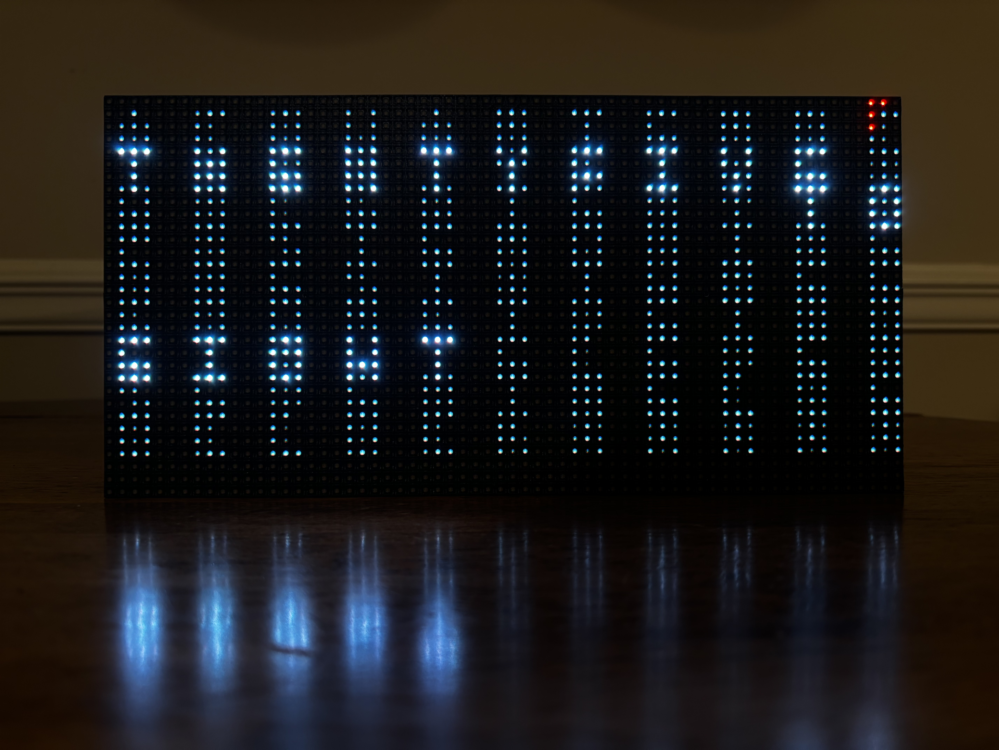

# Scrabble Clock
[](Media/quarter_to.jpeg)

# Word Clock Display

This project drives a 64×32 RGB LED matrix to display a word-clock. The display highlights only the words that represent the current time in five-minute increments. It also includes a red AM/PM indicator.

## Overview

The program:

* Renders a 9x11 letter grid.
* Dims all unused characters.
* Lights only the words describing the current time.
* Shows AM/PM indictoar in the top-right corner using the Braille alphabet("A" for AM, "p" for PM).
* Updates every minute in 5 minute increments.

## Grid Layout

A static 9x11 character map forms the basis of the word clock:

```
"ITLISASTIME",   # ROW 0 — IGNORED
"ACQUARTERDC",
"TWENTYFIVEX",
"HALFBTENYTO",
"PASTERUNINE",
"ONESIXTHREE",
"FOURFIVETWO",
"EIGHTELEVEN",
"SEVENTWELVE",
"OCLOCKXXXXX"
```

Letters are placed with fixed spacing and centered in a 64×32 matrix using defined cell size and offsets.

## Word Coordinates

Each word (e.g., TEN, QUARTER, HALF) is mapped to grid coordinates. Ranges expand into individual cell positions, enabling precise highlighting.

## Time Conversion Logic

The script determines the correct words based on the current time:

* Minutes are rounded down to the nearest multiple of five.
* Logic selects PAST or TO.
* "TO" cases roll the hour forward.
* Special cases include QUARTER, HALF, TWENTY-FIVE, etc.

Examples:

* 3:00 → THREE O'CLOCK
* 3:15 → QUARTER PAST THREE
* 3:40 → TWENTY TO FOUR

## Rendering

### Background

All grid letters render dimly as ambient text.

### Active Words

Characters belonging to the selected time words are drawn bright white.

### AM/PM Indicator

Using the [braille](https://www.brailleliteracycanada.ca/en/braille) alphabet to show AM/PM status in red:

* A = AM
  [](Media/AM.jpeg)
* P = PM
  [](Media/PM.jpeg)


### Matrix Update

The final image is sent to the LED matrix each second.

## Main Loop

The program:

1. Computes the words for the current time.
2. Draws the full image (dim text, highlighted words, AM/PM block).
3. Sends the image to the matrix.
4. Sleeps for one second.

